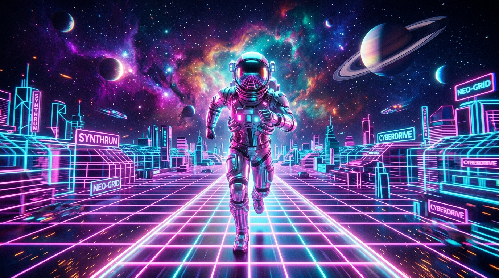

# Infuse Galaxy Run 🌌🏃‍♂️



A high-speed, fully interactive 3D synthwave runner built with React, Three.js, React Three Fiber, and Tailwind CSS. Swerve through cyber-lanes, collect glowing level-specific keywords, purchase powerful upgrades from the integrated retro shop portal, and dominate the synthwave cosmos!

---

## 🎮 Key Features

* **Advanced 3D Astronaut Runner**: Control an exquisite, highly detailed 3D spacesuit character equipped with animated jetpack flames, shoulder pauldrons, glowing power cores, helmet visors, and realistic segmented limb movements.
* **Coordinate Maps Choice (Dynamic Environments)**: Select from 4 highly stylized environments, each featuring distinct visual signatures, ambient speeds, and obstacle density rates:
  * **Andromeda Path**: Classic violet and pink cosmic cruising.
  * **Neon Tokyo Grid**: Accelerated cyan neon metropolis cruise.
  * **Solar Flare Orbit**: Intense red/orange debris field near a dying star.
  * **Void Abyss Sector**: Pristine gold-on-black monochromatic hyper-horizon.
* **Custom Spacesuit Presets**: Toggle between four distinctive suit skins (**Cyber Cyan**, **Nova Pink**, **Void Gold**, **Plasma Mint**), altering armor materials, joint metals, and glow accents in real-time.
* **Dynamic Level Keywords**: Complete objectives on each level by gathering letters representing cosmic milestones:
  * **Level 1**: `NEON`
  * **Level 2**: `COSMOS`
  * **Level 3**: `GALAXY`
  * **Level 4**: `HYPER`
  * **Level 5**: `INFINITY`
* **Real-time Retro Shop**: Acquire custom power-ups using collected cosmic gems to gain abilities like Double Jumps, Max Lives upgrades, and Instant Immortality gas shields.

---

## 🛠️ Controls

* **A / D** or **Left / Right Arrow Keys**: Move Lanes left/right.
* **W** or **Up Arrow Key / Spacebar**: Jump (Double Jump if purchased!).
* **S** or **Down Arrow Key**: Activate Immortality power shield (requires purchase).
* **Mobile Swipe Controls**: Swipe Left/Right to shift lanes, Swipe Up to Jump.

---

## 🚀 Getting Started

### Prerequisites

* **Node.js** (v18.x or higher)
* **npm** or **yarn**

### Installation

1. Clone the repository:
   ```bash
   git clone https://github.com/your-username/infuse-galaxy-run.git
   cd infuse-galaxy-run
   ```

2. Install dependencies:
   ```bash
   npm install
   ```

3. Run the development server:
   ```bash
   npm run dev
   ```

4. Build for production:
   ```bash
   npm run build
   ```

---

## 📦 Stack Configuration

* **Runtime**: React (v19) + Vite
* **3D Engine**: Three.js + React Three Fiber (`@react-three/fiber`)
* **Helpers**: React Three Drei (`@react-three/drei`)
* **Post-processing**: `@react-three/postprocessing` + `postprocessing`
* **State Management**: Zustand
* **Styling**: Tailwind CSS
* **Icons**: Lucide React
